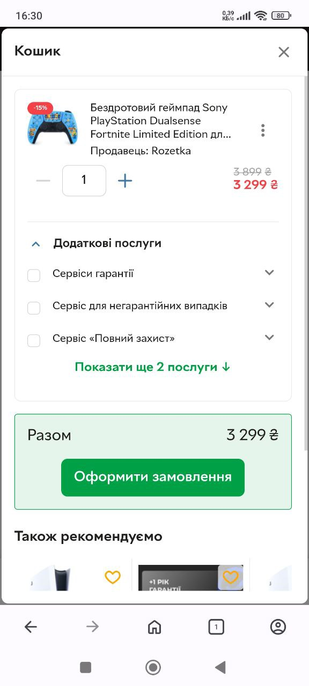
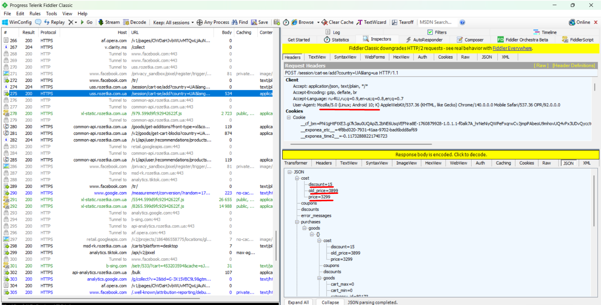
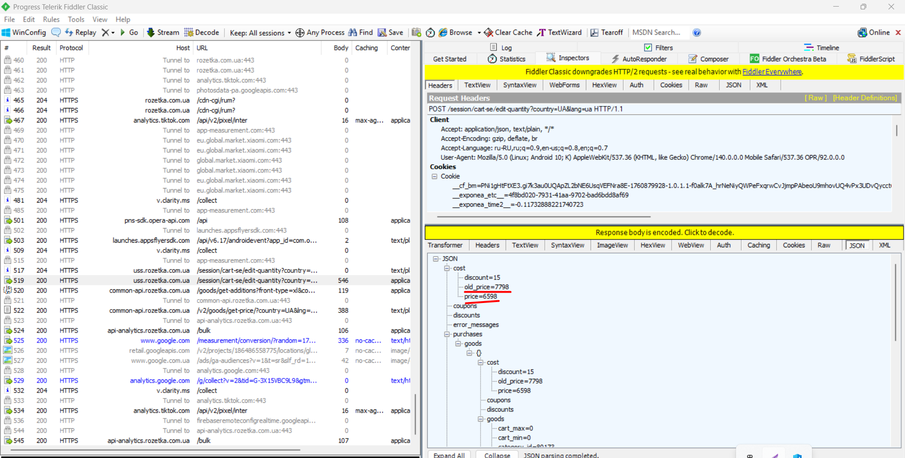
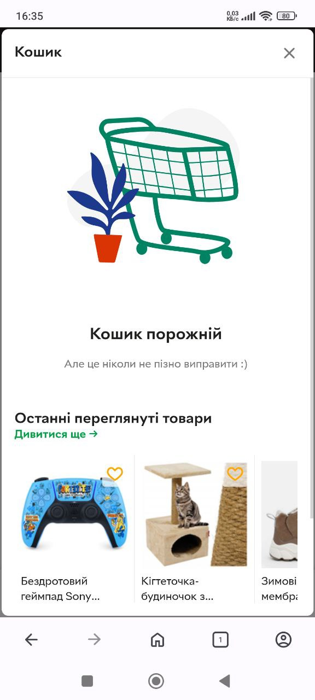
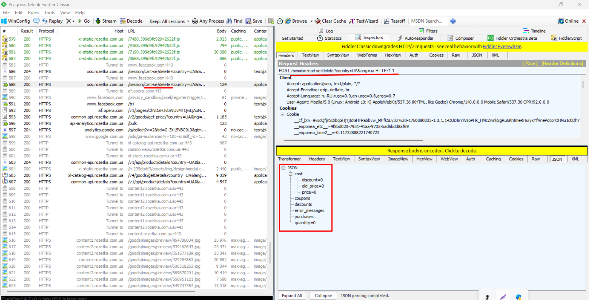

# Test Case: Add and Remove Product in Cart

**ID:** TC-API-002  
**Type:** Functional / API + UI  
**Priority:** Medium  
**Status:** Pass  

## Preconditions
1. Fiddler Classic is installed and configured.  
2. Phone is connected to Wi-Fi with manual proxy:  
   - Host: `<your IP>`  
   - Port: `8888`  
3. Mobile site [Rozetka.com.ua](https://rozetka.com.ua) is open on the phone.  

## Steps
### UI
1. In the search bar, enter `PlayStation DualSense Fortnite Limited Edition` and press enter.  
2. Add the product to the cart.  
3. Increase the quantity in the cart to 2.  
4. Clear the cart.  

### API
5. In Fiddler, locate the corresponding requests and verify correct API behavior:  
   - Product is added correctly.  
   - Quantity updates correctly.  
   - Cart clearing request works.  

## Expected Result
- **UI:** Products are correctly added, quantity updated, and removed from the cart.  
- **API:** Requests match UI actions; JSON responses reflect the correct product data and quantities.  

## Screenshots
1. **UI Add 1 item** – Phone shows 1 product added.  
     
2. **API Add 1 item** – Fiddler shows request for adding 1 product.  
     
3. **UI Quantity 2** – Phone shows 2 products in cart.  
     
4. **API Quantity 2** – Fiddler shows request with updated quantity.  
     
5. **UI Cart cleared** – Phone shows empty cart.  
     
6. **API Cart cleared** – Fiddler shows request to clear cart.  
     