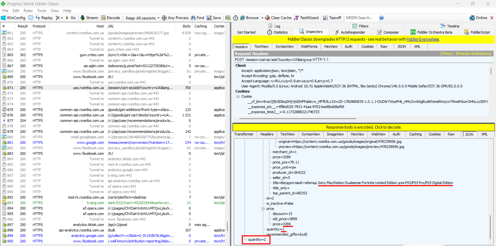
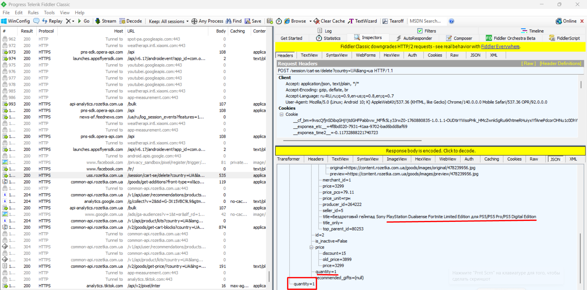

# Test Case: Cart Functionality - Add/Remove Multiple Products

**ID:** TC-API-004  
**Type:** Functional / API + UI  
**Priority:** Medium  
**Status:** Pass  

## Preconditions
1. Fiddler Classic is installed and configured.  
2. Phone is connected to Wi-Fi with manual proxy:  
   - Host: `<your IP>`  
   - Port: `8888`  
3. Mobile site [Rozetka.com.ua](https://rozetka.com.ua) is open on the phone.  

## Steps
### UI
1. Add product `Sony PlayStation 5 Slim` to the cart.  
2. Add product `PlayStation DualSense Fortnite Limited Edition` to the cart.  
3. Verify in the UI that there are 2 products with correct quantities and prices.  
4. Remove product `Sony PlayStation 5 Slim` from the cart.  
5. Verify in the UI that the remaining product shows correct quantity and updated total price.  

### API
6. In Fiddler, check the corresponding cart requests for add/remove actions.  
7. Verify that JSON responses reflect the correct products, quantities, and prices after each action.  

## Expected Result
- **UI:** Cart shows the correct products, quantities, and prices after each action.  
- **API:** Requests and JSON responses correctly reflect cart changes.  

## Screenshots
1. **UI Cart after adding 2 products**  
     
2. **API Request/Response after adding 2 products**  
     
3. **UI Cart after removing 1 product**  
     
4. **API Request/Response after removing 1 product**  
     