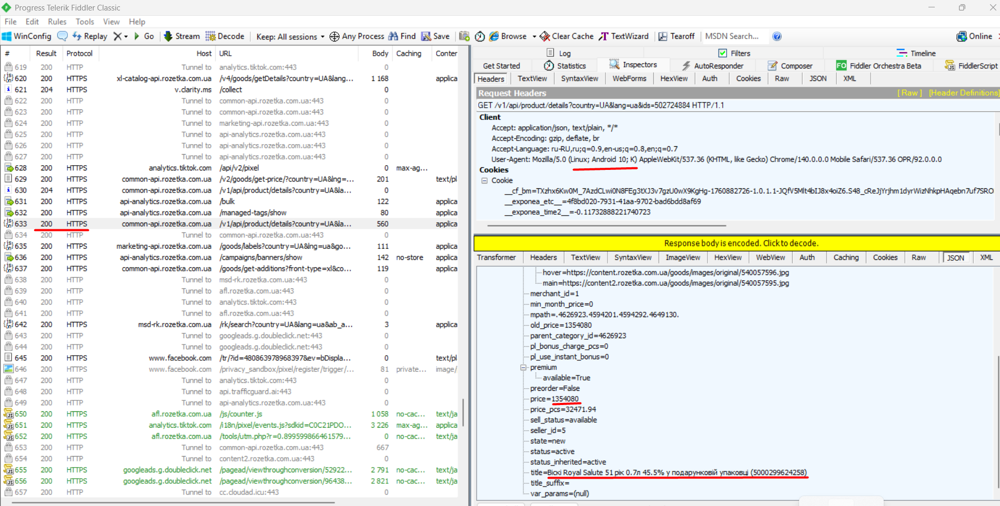

# Test Case: Correct Functioning of Search Filters on Rozetka

**ID:** TC-API-001  
**Type:** Functional / API + UI  
**Priority:** Medium  
**Status:** Pass  

## Preconditions
1. Fiddler Classic is installed and configured.  
2. Phone is connected to Wi-Fi with manual proxy:  
   - Host: `<your IP>`  
   - Port: `8888`  
3. Mobile site [Rozetka.com.ua](https://rozetka.com.ua) is open on the phone.  

## Steps
### UI
1. Enter `Jim Beam` in the main page search bar and press Enter.  
2. On the new page, open filters.  
3. Set filter "Price from" = `1,000,000 UAH`.  

### API
4. In Fiddler, capture the corresponding search request.  
5. Check request parameters:  
   - 'price' > 1000000  
   - 'title' = "%Royal Salute%"  
6. Check JSON response:  
   - HTTP Status = 200  
   - Contains product `Royal Salute 51 year`  
   - Price matches the filter  

## Expected Result
- **UI:** Product `Royal Salute 51 year` is visible on the phone screen.  
  
- **API:** JSON response contains the correct product with the proper request parameters and price.  

