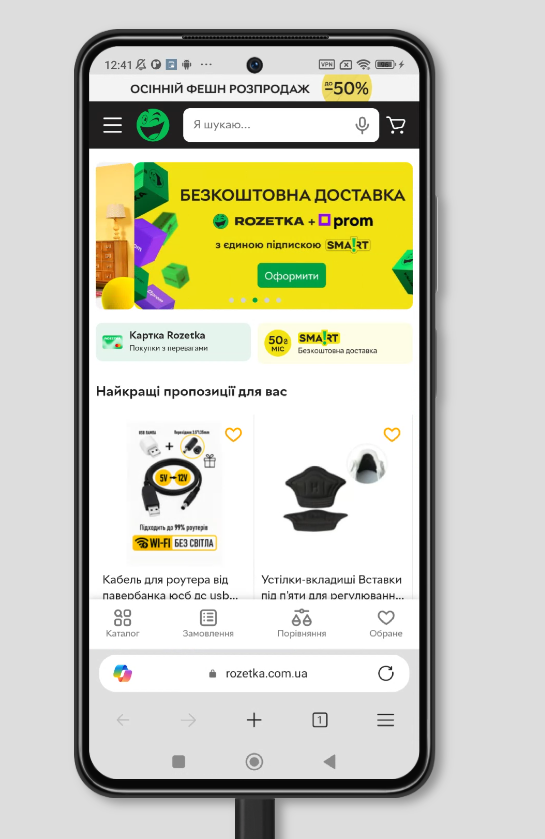
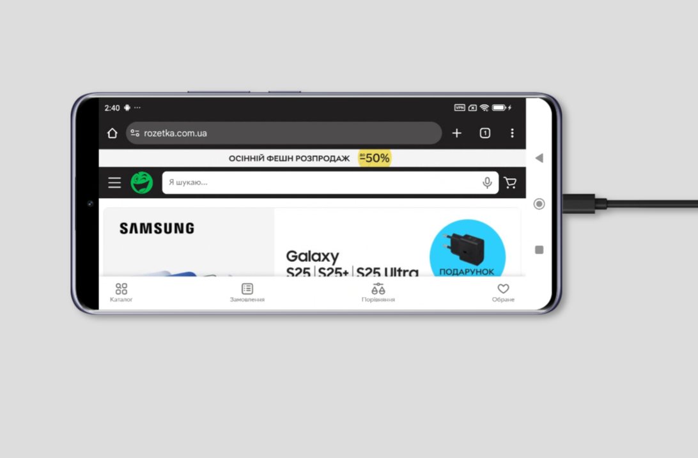

# Cross-Browser Testing — Rozetka Mobile

**Goal:** Verify the correct display and functionality of the Rozetka website across different mobile browsers and devices.  

**Description:**  
Screenshots were taken using **BrowserStack** on various mobile devices and browsers (**Chrome**, **Safari**, **Edge**, **Samsung Internet**, **Mozilla**).  
The purpose of this test was to confirm that all key UI elements — banners, menus, buttons, product cards, and filters — are displayed and function properly in each browser environment.

## Devices, Browsers, and Screenshots

**iPhone 14** — Safari  
  

**Samsung Galaxy S22** — Edge  

**iPhone 15** — Chrome  
  

**Redmi Note 11** — Edge  
  

**Redmi Note 14 Pro** — Chrome  
  

**Samsung Galaxy S22+** — Mozilla  

**Samsung Galaxy A52** — Samsung Browser  
  

---

**Comments:**  
- The Rozetka website displays correctly across all tested browsers and devices.  
- UI elements (buttons, filters, banners) maintain consistent alignment and behavior.  
- No layout breaks or rendering issues observed.  
- Website adapts properly to browser-specific engines and resolutions.  