# Viewport Testing — Rozetka Mobile

**Goal:** Show the responsiveness of the Rozetka website on different devices, OS, screen resolutions, and orientations.  

**Description:**  
Screenshots were taken on BrowserStack on popular mobile devices. Checked correct rendering of the homepage: banners, menu, buttons, and product cards.

## Devices and Screenshots

**Samsung Galaxy A51** — 1080 × 2400  
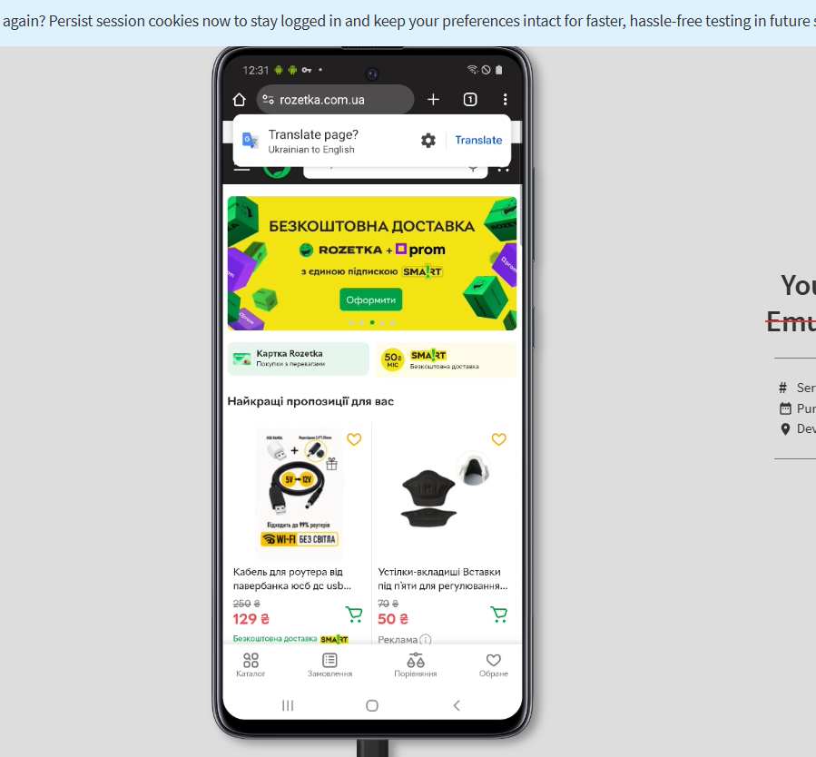

**Samsung Galaxy S22** — 1080 × 2340  
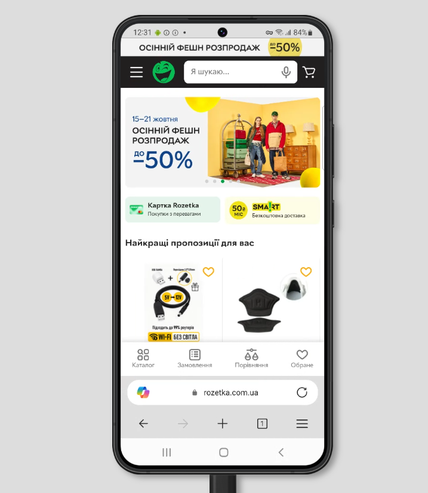

**iPad 9** — 1620 × 2160  
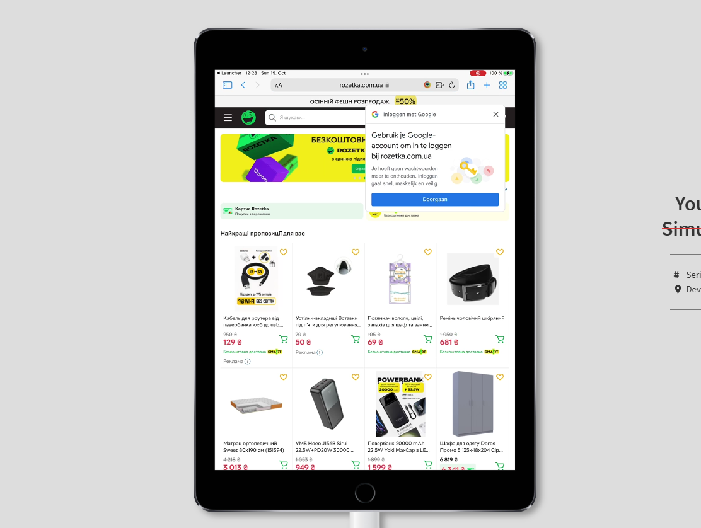

**iPhone 14** — 1170 × 2532  
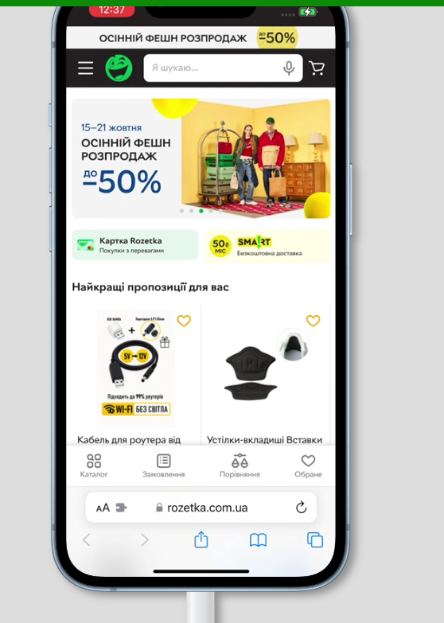  
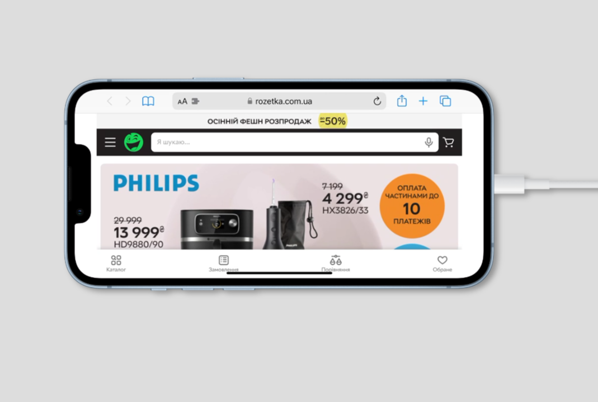

**iPhone 15** — 1179 × 2556  
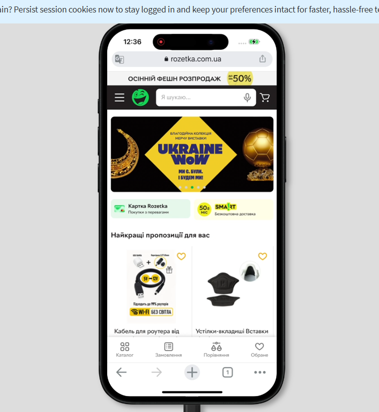  

**Redmi Note 11** — 1080 × 2400  
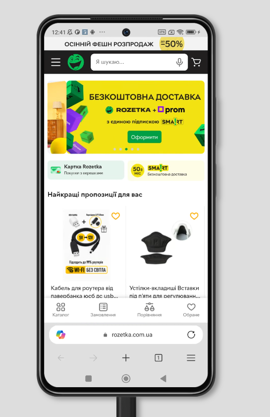  

**Redmi Note 14 Pro** — 1080 × 2400  
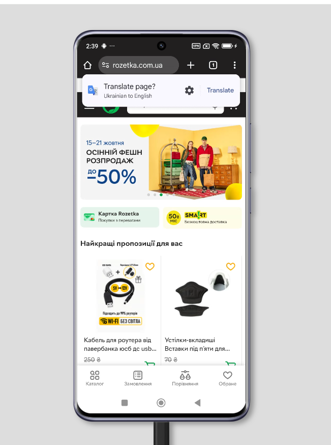  
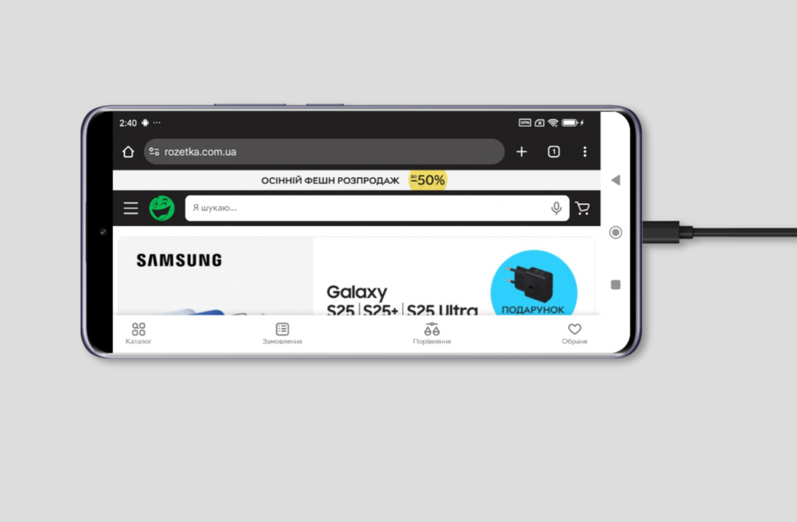

**Samsung Galaxy S22+** — 1080 × 2340  
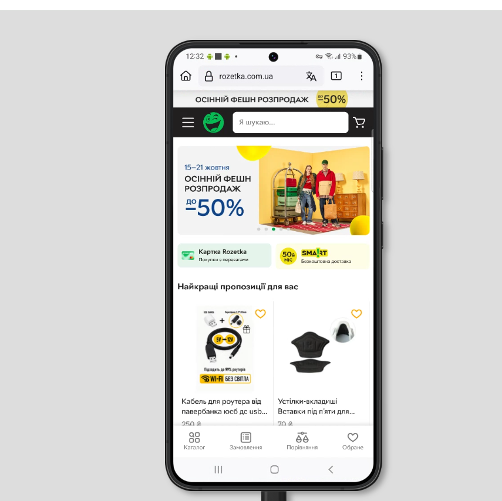

**Samsung Galaxy S23** — 1080 × 2340  
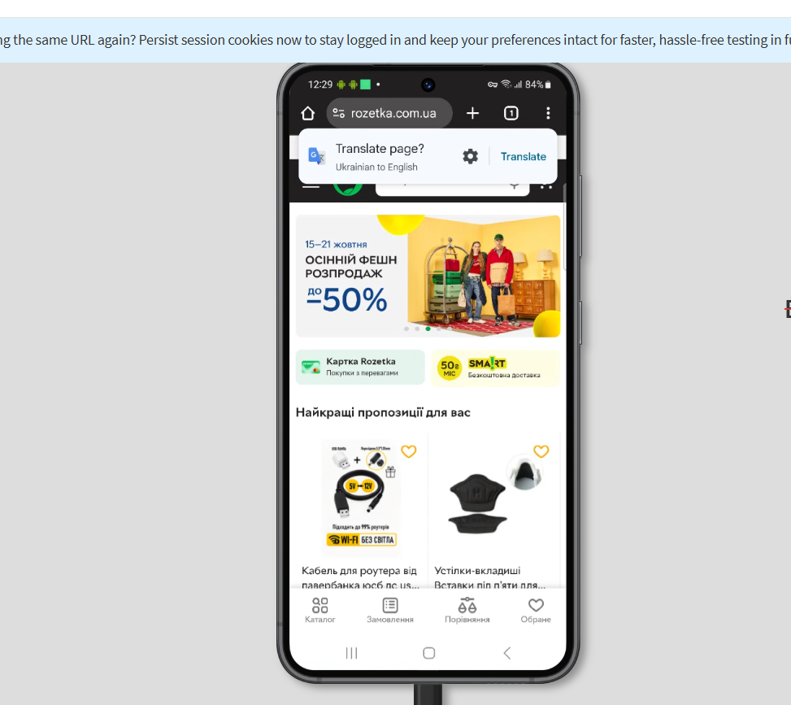

**Samsung Galaxy A52** — 1080 × 2400  
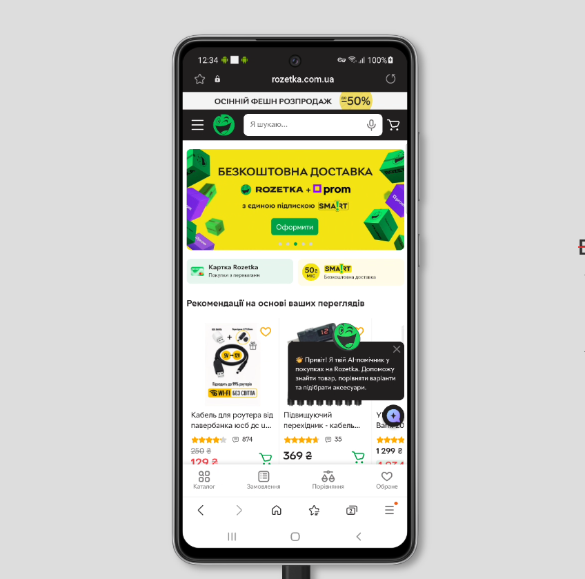  
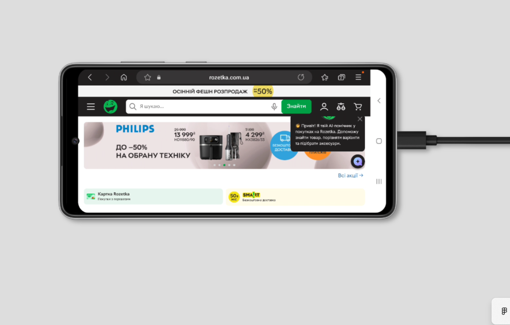

## Comments
- All page elements are displayed correctly on all devices.  
- Menus, banners, and buttons are adapted for different orientations and screen sizes.  
- The page is responsive and renders correctly in both portrait and landscape orientation.