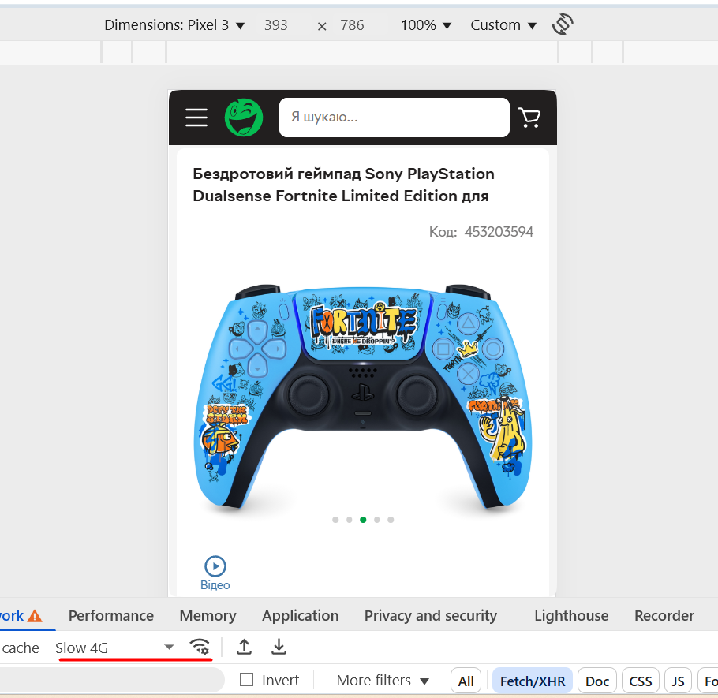

# ✅ Test Case: Slow 4G Network Loading

**ID:** TC-NW-01  
**Type:** Network / Performance  
**Priority:** Medium  
**Status:** Pass  

## Preconditions / Environment
- Open **Rozetka** mobile site in **Chrome DevTools**.  
- Enable **Device Toolbar** and select device **Pixel 3**.  
- Set network throttling to **Slow 4G**.  

## Steps
1. Go to [https://rozetka.com.ua](https://rozetka.com.ua).  
2. Observe page loading process.  
     

## Expected Result
- Page loads within 3–5 seconds.  
- Key elements (header, search bar, banners) appear progressively.  
- Layout remains stable; images and content load correctly; no errors or timeouts occur.  