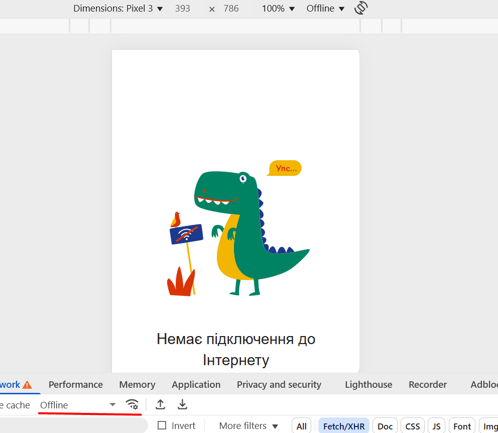

# ✅ Test Case: Offline Mode Handling

**ID:** TC-NW-03  
**Type:** Network / Performance  
**Priority:** Medium  
**Status:** Pass  

## Preconditions / Environment
- Open **Rozetka** mobile site in **Chrome DevTools**.  
- Enable **Device Toolbar** and select device **Pixel 3**.  
- Set network throttling to **Offline**.  

## Steps
1. Go to [https://rozetka.com.ua](https://rozetka.com.ua).  
2. Observe page behavior when offline.  
     

## Expected Result
- Page does not crash or freeze.  
- A proper offline message or error is displayed.  
- Layout remains stable; previously loaded content (if any) is shown correctly.  