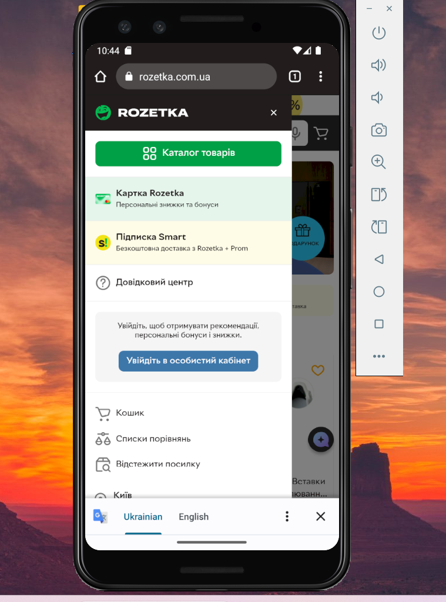

# Test Case: Burger Menu on Homepage

**ID:** TC-UI-01  
**Type:** Functional / UI  
**Priority:** Medium  
**Status:** Pass  

## Preconditions / Environment
- Android Studio is installed and configured.  
- Emulator device: **Pixel 3**, Android 13.  
- Emulator launched with command:   
C:\Users\jelez\AppData\Local\Android\Sdk\emulator\emulator.exe -avd Pixel_3 -dns-server 8.8.8.8   
- Rozetka mobile website is open on the emulator.   

## Steps
1. Tap the burger menu icon in the top-left corner of the homepage.  
     

## Expected Result
- The burger menu is displayed correctly.  
- Layout remains stable and does not shift.  
- All menu items are clickable and navigate to the correct pages.  
- No visual defects or overlapping elements are present.  