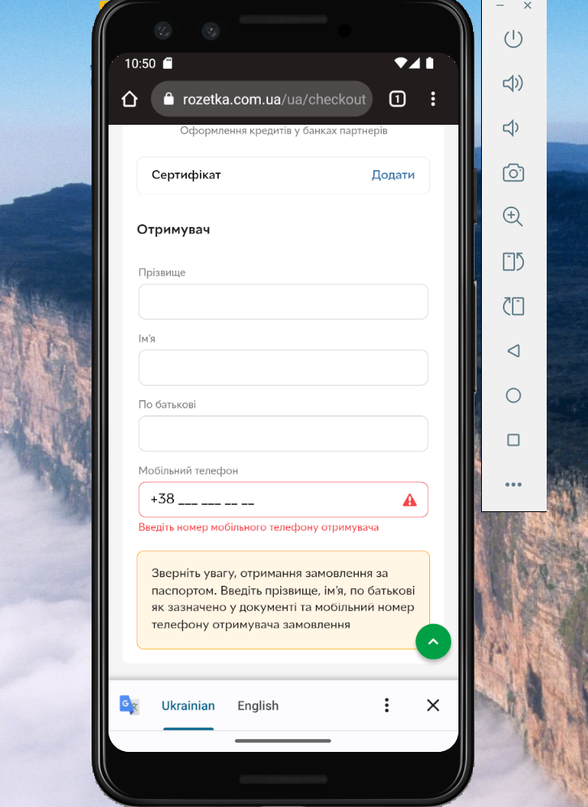

# Test Case: Checkout Flow on Rozetka Mobile

**ID:** TC-UI-04  
**Type:** Functional / UI  
**Priority:** High  
**Status:** Pass  

## Preconditions / Environment
- Android Studio is installed and configured.  
- Emulator device: **Pixel 3**, Android 13.  
- Emulator launched with command:  
C:\Users\jelez\AppData\Local\Android\Sdk\emulator\emulator.exe -avd Pixel_3 -dns-server 8.8.8.8  
- Rozetka mobile website is open on the emulator.  

## Steps
1. In the search bar, enter `Asus Nitro V 15` and press Enter.  
2. Select the first product in the search results and add it to the cart.  
3. In the pop-up alert, confirm that the product was added and tap **Open Cart**.  
4. Click the ‘Checkout’ button in the cart.  
5. Enter phone number `0963665509` and verification code `6655`.  
     
6. Observe the checkout form with fields: full name, phone number, delivery address, payment options, etc.  
      

## Expected Result
- Checkout page loads correctly with all required fields.  
- All input fields are clickable and editable.  
- Delivery and payment options are displayed properly.  
- No visual defects or overlapping elements are present.  
- Layout works correctly in portrait orientation.  