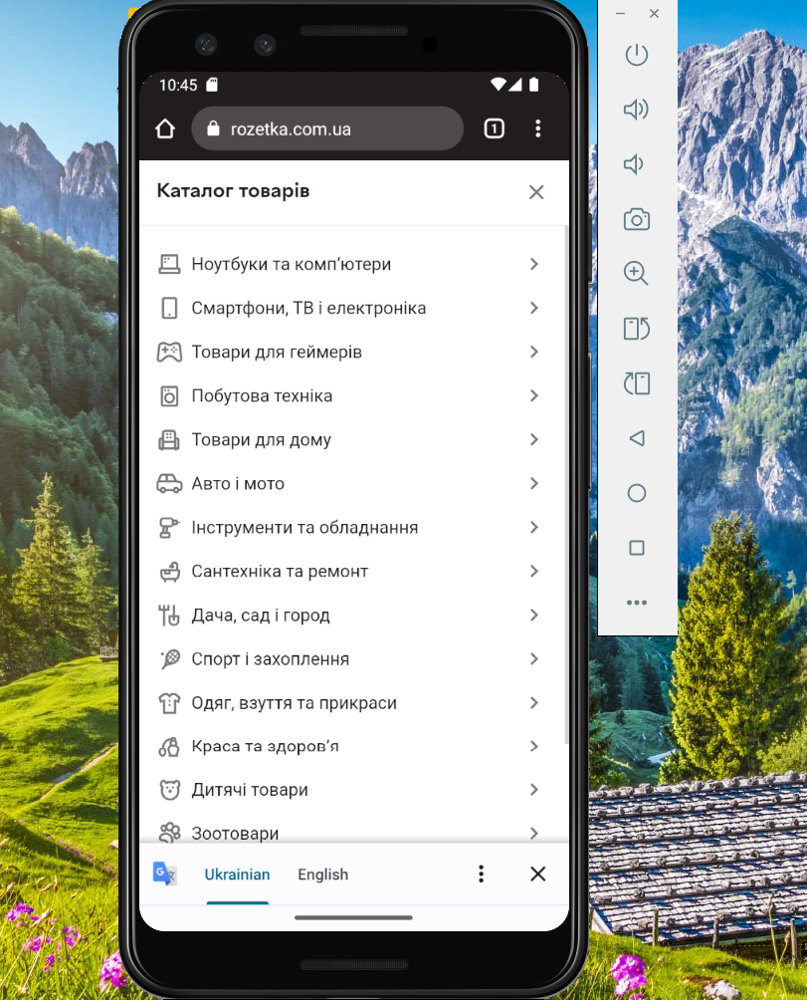

# Test Case: Open Catalog from Main Menu

**ID:** TC-UI-02  
**Type:** Functional / UI  
**Priority:** Medium  
**Status:** Pass  

## Preconditions / Environment
- Android Studio is installed and configured.  
- Emulator device: **Pixel 3**, Android 13.  
- Emulator launched with command:  
C:\Users\jelez\AppData\Local\Android\Sdk\emulator\emulator.exe -avd Pixel_3 -dns-server 8.8.8.8  
- Rozetka mobile website is open on the emulator.  

## Steps
1. Tap the **Catalog** button in the bottom-left corner of the main menu.  
     

## Expected Result
- The Catalog menu opens correctly.  
- All sections and categories are loaded completely.  
- All items are clickable and navigate to the correct pages.  
- No visual defects, overlapping elements, or missing items are present. 