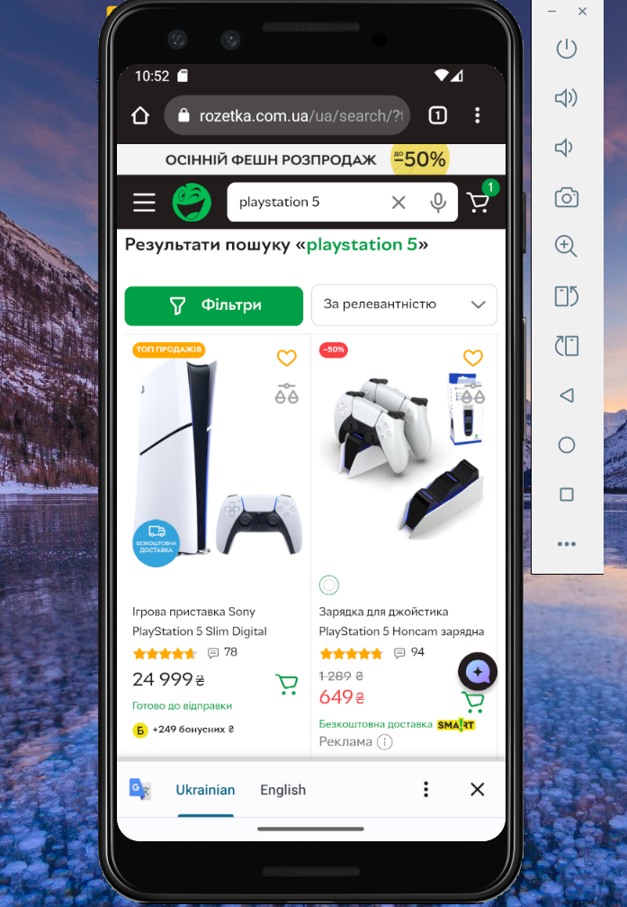

# Test Case: Product Search — “PlayStation 5”  

**ID:** TC-UI-05    
**Type:** Functional / UI  
**Priority:** Medium  
**Status:** Pass  

## Preconditions / Environment  
- Android Studio is installed and configured.  
- Emulator device: **Pixel 3**, Android 13.  
- Emulator launched with command:  
  `C:\Users\jelez\AppData\Local\Android\Sdk\emulator\emulator.exe -avd Pixel_3 -dns-server 8.8.8.8`  
- Rozetka mobile website is open on the emulator.  

## Steps  
1. Enter **“PlayStation 5”** into the search bar.  
2. Press **Enter** on the virtual keyboard.  
      

## Expected Result  
- The search results page loads successfully.  
- Products displayed correspond to the entered query (**“PlayStation 5”**).  
- Product titles, images, and prices are displayed correctly.  
- No empty or unrelated results appear.  