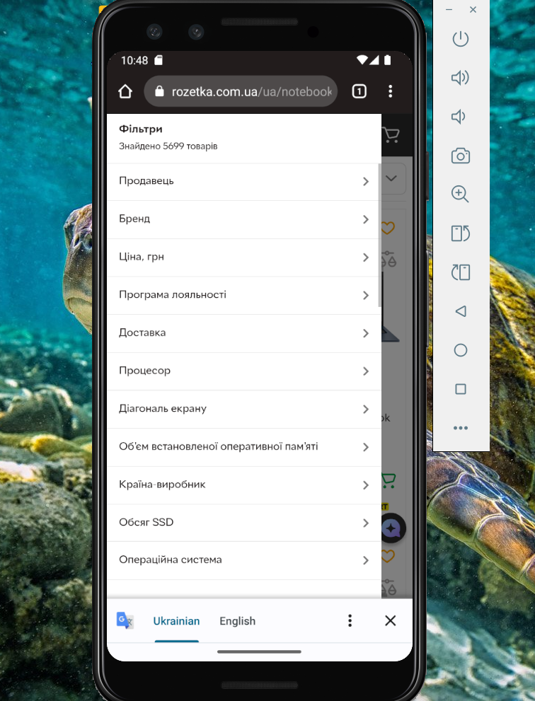

# Test Case: Search Filters Functionality — “Asus Nitro V 15”  

**ID:** TC-UI-07    
**Type:** Functional / UI  
**Priority:** Medium  
**Status:** Pass  

## Preconditions / Environment  
- Android Studio is installed and configured.  
- Emulator device: **Pixel 3**, Android 13.  
- Emulator launched with command:  
  `C:\Users\jelez\AppData\Local\Android\Sdk\emulator\emulator.exe -avd Pixel_3 -dns-server 8.8.8.8`  
- Rozetka mobile website is open on the emulator.  

## Steps  
1. Enter **“Asus Nitro V 15”** in the search bar on the homepage and press **Enter**.  
2. Open the **filter panel** by tapping the filter icon in the top-left corner of the search results page.  
     

## Expected Result  
- The search filter panel opens correctly.  
- All available filter options (brand, price, specs, etc.) are displayed.  
- Filters can be applied and cleared without issues.  
- The product list updates according to selected filters.  
- Sorting and filtering work correctly without UI glitches or reload errors. 